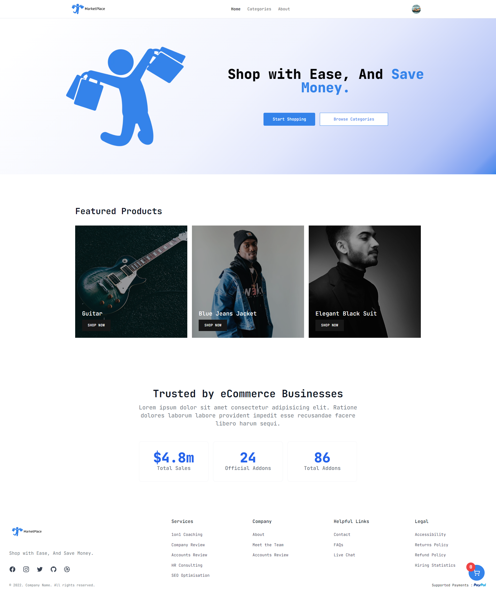

<h1 align="center" >
  
  <p align="center">  MarketPlace</p>
</h1>

<h2 align="center">MarketPlace is a single product E-commerce web application built with NextJs and is backed and controlled by the <a target="_blank" href="https://v-store-dashboard-client-c1tuemi2s-medthevorgs-projects.vercel.app/">VStore CMS Dashboard</a></h2>

<br/>

<p align="center">
  <a href="#key-features">Key Features</a> •
  <a href="#how-to-use">How To Use</a> •
  <a href="#technologies">Technologies</a> •
  <a href="#preview">Preview</a> •
  <a href="#license">License</a>
</p>


# Key Features

* Shopping cart ( protected route ):
  - users can add and delete products from the cart. 

* Authentication/authorization with Clerk :
  - only signed in customers can consult the cart and make a purchase.

* Paypal Payment :
  - receive payments from customers with paypal.

* Category page :
  - each category has its own products page.
  - filter products by size and/or color.

* Product page :
  - inspect a product page details.
  - related products are also shown based on the product category

* Validation with zod :
  - every form is validated with zod.
  
* Responsive design


# How To Use

To clone and run this application, you'll need [Git](https://git-scm.com) and [Node.js](https://nodejs.org/en/download/) (which comes with [npm](http://npmjs.com)) installed on your computer. From your command line:

```bash
# Clone this repository
$ git clone https://github.com/MedtheVorg/V-Store.git

# Go into the MarketPlace_Store folder
$ cd MarketPlace_Store

# Install dependencies 
$ npm install

# provide environment variables
  # in the root folder create a .env.local file with the following variables 

      # Store instance
      # you will need to have an account on the VStore CMS Dashboard, after login in go to settings and grab your "EXPRESS_SERVER_PUBLIC_API_URL" 

      NEXT_PUBLIC_API_URL="" # EXPRESS_SERVER_PUBLIC_API_URL
      NEXT_PUBLIC_STORE_ID="" # EXPRESS_SERVER_PUBLIC_API_URL Store ID


      # Paypal ( https://developer.paypal.com/api/rest/ )
      NEXT_PUBLIC_PAYPAL_CLIENT =""
      NEXT_PUBLIC_PAYPAL_SECRET=""


      #  Clerk (  https://clerk.com/docs/quickstarts/nextjs )
      NEXT_PUBLIC_CLERK_PUBLISHABLE_KEY=""
      CLERK_SECRET_KEY=""
      NEXT_PUBLIC_CLERK_SIGN_IN_URL="/sign-in"
      NEXT_PUBLIC_CLERK_SIGN_UP_URL="/sign-up"
      NEXT_PUBLIC_CLERK_AFTER_SIGN_IN_URL="/"
      NEXT_PUBLIC_CLERK_AFTER_SIGN_UP_URL="/"


  # start the development server 
  $ npm run dev
  
  ```

<br/><br/><br/>

# Technologies


[](https://skillicons.dev)


<span style="display:inline" title="react hot toast"><svg width="75px" height="45px" fill="none" xmlns="http://www.w3.org/2000/svg" aria-label="react-hot-toast Logo"><path d="M.647 5.556a3.224 3.224 0 0 1 2.992-3.442L24.038.688a3.225 3.225 0 0 1 3.441 2.991l1.555 22.236a3.225 3.225 0 0 1-2.992 3.441L5.643 30.783a3.224 3.224 0 0 1-3.441-2.992L.647 5.556Z" fill="#482307"></path><path d="M21.314 20.845c.041.07.065.146.07.23.006.085-.03.172-.108.262a.367.367 0 0 1-.262.126l-3.693.259c-.372.026-.642-.118-.809-.433l-1.79-3.332-.738.052.24 3.44c.01.132-.03.25-.12.353a.47.47 0 0 1-.332.168l-3.53.247a.469.469 0 0 1-.352-.12.469.469 0 0 1-.168-.333l-.814-11.636a.469.469 0 0 1 .12-.352c.09-.103.2-.159.332-.168l5.332-.373c1.73-.121 3.107.175 4.135.887 1.026.7 1.59 1.778 1.692 3.23.1 1.442-.469 2.622-1.707 3.541l2.502 3.952Zm-7.703-8.168.134 1.91 1.315-.092c.264-.019.462-.117.595-.295.131-.19.188-.418.17-.682a1.11 1.11 0 0 0-.265-.67c-.146-.194-.357-.282-.634-.263l-1.315.092Z" fill="#fff"></path><path d="M24.811 3.755A3.224 3.224 0 0 1 28.253.763l21.396 1.496a3.224 3.224 0 0 1 2.992 3.442l-1.555 22.235a3.224 3.224 0 0 1-3.441 2.992L26.248 29.43a3.224 3.224 0 0 1-2.992-3.441l1.555-22.235Z" fill="#E15549"></path><path d="m40.347 9.502 3.53.247c.133.01.244.065.333.168.09.103.13.22.12.353l-.813 11.636a.47.47 0 0 1-.169.332.469.469 0 0 1-.352.12l-3.53-.247a.47.47 0 0 1-.333-.168.469.469 0 0 1-.12-.352l.272-3.89-2.918-.205-.272 3.89a.468.468 0 0 1-.168.333.469.469 0 0 1-.352.12l-3.53-.247a.504.504 0 0 1-.334-.15.49.49 0 0 1-.119-.37l.814-11.636a.469.469 0 0 1 .168-.332c.102-.09.22-.13.352-.12l3.53.246c.133.01.243.066.333.168.09.103.13.22.12.353l-.265 3.782 2.919.204.264-3.782a.468.468 0 0 1 .168-.332c.103-.09.22-.13.352-.12Z" fill="#fff"></path><path d="M47.254 5.532a3.224 3.224 0 0 1 2.992-3.441L69.647.734a3.225 3.225 0 0 1 3.442 2.992l1.555 22.235a3.224 3.224 0 0 1-2.992 3.442L52.25 30.759a3.224 3.224 0 0 1-3.441-2.991L47.254 5.532Z" fill="#482307"></path><path d="m55.216 9.637 10.556-.738c.132-.01.25.03.352.12.103.09.159.2.168.332l.203 2.9c.01.132-.031.25-.12.353a.47.47 0 0 1-.332.168l-2.99.209.576 8.25c.01.132-.03.249-.12.352a.469.469 0 0 1-.332.168l-3.603.252a.469.469 0 0 1-.352-.12.47.47 0 0 1-.168-.333l-.577-8.25-2.99.21a.469.469 0 0 1-.352-.12.468.468 0 0 1-.168-.333l-.203-2.9a.469.469 0 0 1 .12-.352c.09-.103.2-.159.332-.168Z" fill="#fff"></path></svg>


## Preview
<p> - Home Page (Desktop)</p>
 <br/>


## License

MIT

---
