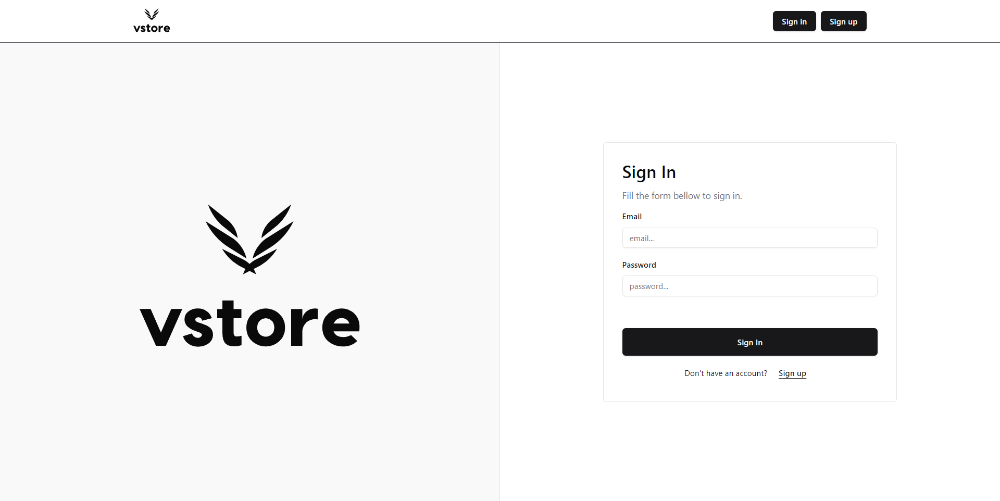

<h1 align="center">
  <a href="http://www.amitmerchant.com/electron-markdownify"></a>
</h1>

<h2 align="center">A Fully fledged dashboard for Single Product E-Commerce stores management built with the  <a href="https://www.mongodb.com/mern-stack" target="_blank">MERN Stack</a>.</h2>


<p align="center">
  <a href="#overview">Overview</a> •
  <a href="#key-features">Key Features</a> •
  <a href="#how-to-use">How To Use</a> •
  <a href="#technologies">Technologies</a> •
  <a href="#deployment">Deployment</a> •
  <a href="#tests">Tests</a> •
  <a href="#preview">Preview</a> •
  <a href="#license">License</a>
</p>

 <br/>

<br/>
<br/>

# Overview
  <h3>Vstore is a CMS dashboard made for single product based E-commerce stores  that lets you create  store instances and manage their content in one place. </h3>
<br/>

# Key Features

* Multiple store instances :
  - Create an infinite number of stores each with its separate data.
* Authentication/authorization with PassportJs :
  - only signed in users can interact with the  store instances.
  - JWT Access token and Refresh token support.
  - persisted logged in user using react redux and localStorage.

* Full CRUD (create, read, update and delete) functionality support for :
  - Store
  - Products
  - Billboards
  - Categories
  - Colors
  - Sizes
  - User (missing Delete handler)
  - Order (Create only)
   
* Validation with zod :
  - every input is validated both at the frontend and the backend.
  - validation middlewares are implemented to protect routes from malicious input. 
* Exposed endpoint routes :
  - with the help of the api endpoints you can read data and implement your own e-commerce store.
* Paypal Payment Support :
  - Target predefined endpoints to implement your own payment process. 
* Dark/Light mode
* Modern interface built with Shadcn and tailwindcss
* Responsive design


# How To Use

To clone and run this application, you'll need [Git](https://git-scm.com) and [Node.js](https://nodejs.org/en/download/) (which comes with [npm](http://npmjs.com)) installed on your computer. From your command line:

```bash
# Clone this repository
$ git clone https://github.com/MedtheVorg/V-Store.git

# Go into the VStore-Dashboard folder
$ cd VStore-Dashboard

# you will have to configure both the client and the server

  # --------------------------BACKEND---------------------------
    # Go into the server folder 
    $ cd server 

    # Install dependencies 
    $ npm install

    # provide environment variables
    # in the root folder create a .env file with the following variables 
    
      # Server
      SERVER_PORT = 4500 
      SERVER_HOSTNAME = "localhost"
      NODE_ENV = "development"

      # Mongo Database
      MONGO_USER = ""
      MONGO_PASSWORD = ""
      MONGO_URL =""
      MONGO_DATABASE =""

      # JWT Authentication (RS256 PEM ENCODED KEY PAIR) (https://cryptotools.net/rsagen)
      PUBLIC_KEY ="-"
      PRIVATE_KEY =""
      ISSUER =""
      AUDIENCE= ""

      # Paypal (https://developer.paypal.com/api/rest/)
      PAYPAL_CLIENT_ID =""
      PAYPAL_CLIENT_SECRET=""

    # start the development server 
    $ npm run start:dev

  # ---------------------------------------------------------------------------

  # -----------------------------FRONTEND-------------------------------
    # Go into the client folder 
    $ cd client 

    # Install dependencies 
    $ npm install

    # provide environment variables
    # in the root folder create a .env file with the following variables 
    
    # cloudinary ( https://cloudinary.com/documentation/upload_programmatically_tutorial )
      VITE_CLOUDINARY_PRESET = "VStore_Cloud"
      VITE_CLOUDINARY_CLOUDNAME = "dj0fgbobx" 

    # Axios
    VITE_BASE_URL = "" 
    #  this is the backend server url, if you don't change the  HOST NAME and PORT  it should be something like this :
    # http://localhost:4500/api/v1.

    # start the development server 
    $ npm run dev
  # -------------------------------------------------------------------------
```
<br/><br/><br/>
# Technologies


### 💻Frontend

[](https://skillicons.dev)


<span style="display:inline" title="react hot toast"><svg width="75" height="32" fill="none" xmlns="http://www.w3.org/2000/svg" class="cursor-pointer" aria-label="react-hot-toast Logo"><path d="M.647 5.556a3.224 3.224 0 0 1 2.992-3.442L24.038.688a3.225 3.225 0 0 1 3.441 2.991l1.555 22.236a3.225 3.225 0 0 1-2.992 3.441L5.643 30.783a3.224 3.224 0 0 1-3.441-2.992L.647 5.556Z" fill="#482307"></path><path d="M21.314 20.845c.041.07.065.146.07.23.006.085-.03.172-.108.262a.367.367 0 0 1-.262.126l-3.693.259c-.372.026-.642-.118-.809-.433l-1.79-3.332-.738.052.24 3.44c.01.132-.03.25-.12.353a.47.47 0 0 1-.332.168l-3.53.247a.469.469 0 0 1-.352-.12.469.469 0 0 1-.168-.333l-.814-11.636a.469.469 0 0 1 .12-.352c.09-.103.2-.159.332-.168l5.332-.373c1.73-.121 3.107.175 4.135.887 1.026.7 1.59 1.778 1.692 3.23.1 1.442-.469 2.622-1.707 3.541l2.502 3.952Zm-7.703-8.168.134 1.91 1.315-.092c.264-.019.462-.117.595-.295.131-.19.188-.418.17-.682a1.11 1.11 0 0 0-.265-.67c-.146-.194-.357-.282-.634-.263l-1.315.092Z" fill="#fff"></path><path d="M24.811 3.755A3.224 3.224 0 0 1 28.253.763l21.396 1.496a3.224 3.224 0 0 1 2.992 3.442l-1.555 22.235a3.224 3.224 0 0 1-3.441 2.992L26.248 29.43a3.224 3.224 0 0 1-2.992-3.441l1.555-22.235Z" fill="#E15549"></path><path d="m40.347 9.502 3.53.247c.133.01.244.065.333.168.09.103.13.22.12.353l-.813 11.636a.47.47 0 0 1-.169.332.469.469 0 0 1-.352.12l-3.53-.247a.47.47 0 0 1-.333-.168.469.469 0 0 1-.12-.352l.272-3.89-2.918-.205-.272 3.89a.468.468 0 0 1-.168.333.469.469 0 0 1-.352.12l-3.53-.247a.504.504 0 0 1-.334-.15.49.49 0 0 1-.119-.37l.814-11.636a.469.469 0 0 1 .168-.332c.102-.09.22-.13.352-.12l3.53.246c.133.01.243.066.333.168.09.103.13.22.12.353l-.265 3.782 2.919.204.264-3.782a.468.468 0 0 1 .168-.332c.103-.09.22-.13.352-.12Z" fill="#fff"></path><path d="M47.254 5.532a3.224 3.224 0 0 1 2.992-3.441L69.647.734a3.225 3.225 0 0 1 3.442 2.992l1.555 22.235a3.224 3.224 0 0 1-2.992 3.442L52.25 30.759a3.224 3.224 0 0 1-3.441-2.991L47.254 5.532Z" fill="#482307"></path><path d="m55.216 9.637 10.556-.738c.132-.01.25.03.352.12.103.09.159.2.168.332l.203 2.9c.01.132-.031.25-.12.353a.47.47 0 0 1-.332.168l-2.99.209.576 8.25c.01.132-.03.249-.12.352a.469.469 0 0 1-.332.168l-3.603.252a.469.469 0 0 1-.352-.12.47.47 0 0 1-.168-.333l-.577-8.25-2.99.21a.469.469 0 0 1-.352-.12.468.468 0 0 1-.168-.333l-.203-2.9a.469.469 0 0 1 .12-.352c.09-.103.2-.159.332-.168Z" fill="#fff"></path></svg> </span>

## 🖥backend

[](https://skillicons.dev)


<br/><br/>


## Deployment

<svg class="MuiBox-root css-15p9n5u" xmlns="http://www.w3.org/2000/svg" viewBox="0 0 24 18" fill="#006AB1" style="--darkreader-inline-fill: #006AB1; width:45px;" data-darkreader-inline-fill=""><path d="M23.763 6.886c-.065-.053-.673-.512-1.954-.512-.32 0-.659.03-1.01.087-.248-1.703-1.651-2.533-1.716-2.57l-.345-.2-.227.328a4.596 4.596 0 0 0-.611 1.433c-.23.972-.09 1.884.403 2.666-.596.331-1.546.418-1.744.42H.752a.753.753 0 0 0-.75.749c-.007 1.456.233 2.864.692 4.07.545 1.43 1.355 2.483 2.409 3.13 1.181.725 3.104 1.14 5.276 1.14 1.016 0 2.03-.092 2.93-.266 1.417-.273 2.705-.742 3.826-1.391a10.497 10.497 0 0 0 2.61-2.14c1.252-1.42 1.998-3.005 2.553-4.408.075.003.148.005.221.005 1.371 0 2.215-.55 2.68-1.01.505-.5.685-.998.704-1.053L24 7.076l-.237-.19Z"></path><path d="M2.216 8.075h2.119a.186.186 0 0 0 .185-.186V6a.186.186 0 0 0-.185-.186H2.216A.186.186 0 0 0 2.031 6v1.89c0 .103.083.186.185.186Zm2.92 0h2.118a.185.185 0 0 0 .185-.186V6a.185.185 0 0 0-.185-.186H5.136A.185.185 0 0 0 4.95 6v1.89c0 .103.083.186.186.186Zm2.964 0h2.118a.186.186 0 0 0 .185-.186V6a.186.186 0 0 0-.185-.186H8.1A.185.185 0 0 0 7.914 6v1.89c0 .103.083.186.186.186Zm2.928 0h2.119a.185.185 0 0 0 .185-.186V6a.185.185 0 0 0-.185-.186h-2.119a.186.186 0 0 0-.185.186v1.89c0 .103.083.186.185.186Zm-5.892-2.72h2.118a.185.185 0 0 0 .185-.186V3.28a.186.186 0 0 0-.185-.186H5.136a.186.186 0 0 0-.186.186v1.89c0 .103.083.186.186.186Zm2.964 0h2.118a.186.186 0 0 0 .185-.186V3.28a.186.186 0 0 0-.185-.186H8.1a.186.186 0 0 0-.186.186v1.89c0 .103.083.186.186.186Zm2.928 0h2.119a.185.185 0 0 0 .185-.186V3.28a.186.186 0 0 0-.185-.186h-2.119a.186.186 0 0 0-.185.186v1.89c0 .103.083.186.185.186Zm0-2.72h2.119a.186.186 0 0 0 .185-.186V.56a.185.185 0 0 0-.185-.186h-2.119a.186.186 0 0 0-.185.186v1.89c0 .103.083.186.185.186Zm2.955 5.44h2.118a.185.185 0 0 0 .186-.186V6a.185.185 0 0 0-.186-.186h-2.118a.185.185 0 0 0-.185.186v1.89c0 .103.083.186.185.186Z"></path></svg>
docker was used to dockerize  both the frontend and the server and the images were deployed to a dockerhub public repository.

public repository : <a href="https://hub.docker.com/r/mohamedlem/vstore/tags" target="_blank">docker hub public repo</a>

- RUN IT YOURSELF
  - you can run the Vstore on your local machine by running the following command : 
  ```bash
  # NOTE : make sure you have docker installed in your machine first!

  # create the client image :
  docker build -t "react-app" ./client/

  # create the server image :
  docker build -t "express-server" ./server/

  # run the docker compose : (run both images at the same time)
  docker-compose up
  ```

</br>
</br>

## Tests

Jest was used to write integration tests and  you can run them using the following command : 

```bash
npm run test
```


## Preview
<p> - Home Page (Desktop)</p>
 <br/><br/><br/>
<p> - Sign In Page</p>
 <br/> <br/><br/>
<p> - Sign Up Page</p>
 <br/><br/><br/>
<p> - Dashboard Page</p>
 <br/><br/><br/>
<p> - Home Page (Mobile)</p>
 <br/><br/><br/>


## License

MIT

---
