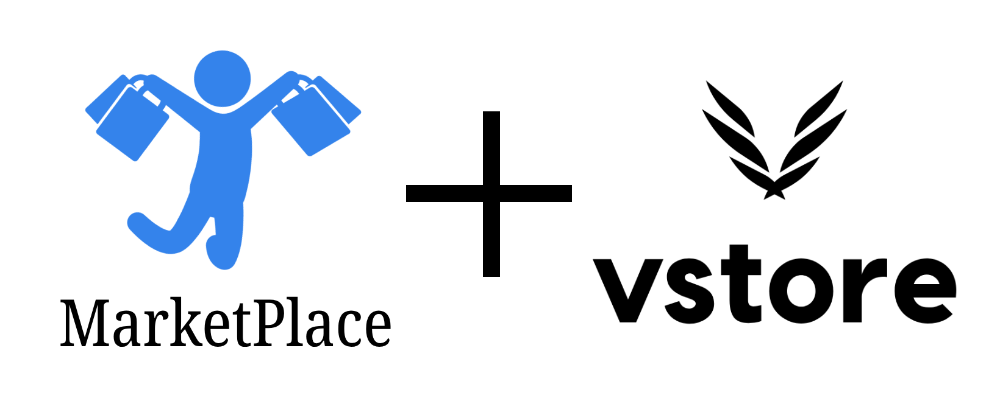

  

<h1>What you should know</h1>

this repository contains two separate projects but one completes the other  

## VStore 
Vstore is a Content Management System (CMS) dashboard that provides data to Single product E-commerce web applications and to know more about it check its folder <a href="./VStore-Dashboard/">VStore-Dashboard</a>

## MarketPlace 
MarketPlace is an E-commerce store with Paypal supported payment which is built on the VStore provided service and to know more about it check its folder <a href="./MarketPlace_Store/">MarketPlace_Store</a>

